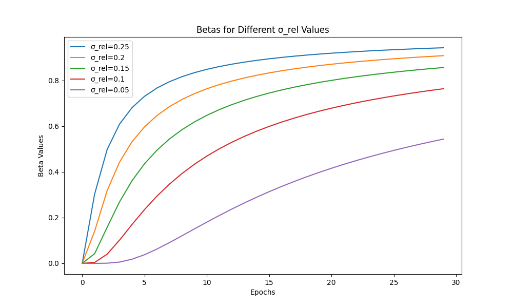

> 📝 Click on the language section to expand / 言語をクリックして展開

# Advanced configuration / 高度な設定

## Table of contents / 目次

- [How to specify `network_args`](#how-to-specify-network_args--network_argsの指定方法)
- [LoRA+](#lora)
- [Select the target modules of LoRA](#select-the-target-modules-of-lora--loraの対象モジュールを選択する)
- [Save and view logs in TensorBoard format](#save-and-view-logs-in-tensorboard-format--tensorboard形式のログの保存と参照)
- [Save and view logs in wandb](#save-and-view-logs-in-wandb--wandbでログの保存と参照)
- [FP8 weight optimization for models](#fp8-weight-optimization-for-models--モデルの重みのfp8への最適化)
- [PyTorch Dynamo optimization for model training](#pytorch-dynamo-optimization-for-model-training--モデルの学習におけるpytorch-dynamoの最適化)
- [LoRA Post-Hoc EMA merging](#lora-post-hoc-ema-merging--loraのpost-hoc-emaマージ)
- [MagCache](#magcache)

## How to specify `network_args` / `network_args`の指定方法

The `--network_args` option is an option for specifying detailed arguments to LoRA. Specify the arguments in the form of `key=value` in `--network_args`.

<details>
<summary>日本語</summary>
`--network_args`オプションは、LoRAへの詳細な引数を指定するためのオプションです。`--network_args`には、`key=value`の形式で引数を指定します。
</details>

### Example / 記述例

If you specify it on the command line, write as follows. / コマンドラインで指定する場合は以下のように記述します。

```bash
accelerate launch --num_cpu_threads_per_process 1 --mixed_precision bf16 src/musubi_tuner/hv_train_network.py --dit ... 
    --network_module networks.lora --network_dim 32 
    --network_args "key1=value1" "key2=value2" ...
```

If you specify it in the configuration file, write as follows. / 設定ファイルで指定する場合は以下のように記述します。

```toml
network_args = ["key1=value1", "key2=value2", ...]
```

If you specify `"verbose=True"`, detailed information of LoRA will be displayed. / `"verbose=True"`を指定するとLoRAの詳細な情報が表示されます。

```bash
--network_args "verbose=True" "key1=value1" "key2=value2" ...
```

## LoRA+

LoRA+ is a method to improve the training speed by increasing the learning rate of the UP side (LoRA-B) of LoRA. Specify the multiplier for the learning rate. The original paper recommends 16, but adjust as needed. It seems to be good to start from around 4. For details, please refer to the [related PR of sd-scripts](https://github.com/kohya-ss/sd-scripts/pull/1233).

Specify `loraplus_lr_ratio` with `--network_args`.

<details>
<summary>日本語</summary>

LoRA+は、LoRAのUP側（LoRA-B）の学習率を上げることで学習速度を向上させる手法です。学習率に対する倍率を指定します。元論文では16を推奨していますが、必要に応じて調整してください。4程度から始めるとよいようです。詳細は[sd-scriptsの関連PR]https://github.com/kohya-ss/sd-scripts/pull/1233)を参照してください。

`--network_args`で`loraplus_lr_ratio`を指定します。
</details>

### Example / 記述例

```bash
accelerate launch --num_cpu_threads_per_process 1 --mixed_precision bf16 src/musubi_tuner/hv_train_network.py --dit ... 
    --network_module networks.lora --network_dim 32 --network_args "loraplus_lr_ratio=4" ...
```

## Select the target modules of LoRA / LoRAの対象モジュールを選択する

*This feature is highly experimental and the specification may change. / この機能は特に実験的なもので、仕様は変更される可能性があります。*

By specifying `exclude_patterns` and `include_patterns` with `--network_args`, you can select the target modules of LoRA.

`exclude_patterns` excludes modules that match the specified pattern. `include_patterns` targets only modules that match the specified pattern.

Specify the values as a list. For example, `"exclude_patterns=[r'.*single_blocks.*', r'.*double_blocks\.[0-9]\..*']"`.

The pattern is a regular expression for the module name. The module name is in the form of `double_blocks.0.img_mod.linear` or `single_blocks.39.modulation.linear`. The regular expression is not a partial match but a complete match.

The patterns are applied in the order of `exclude_patterns`→`include_patterns`. By default, the Linear layers of `img_mod`, `txt_mod`, and `modulation` of double blocks and single blocks are excluded.

(`.*(img_mod|txt_mod|modulation).*` is specified.)

<details>
<summary>日本語</summary>

`--network_args`で`exclude_patterns`と`include_patterns`を指定することで、LoRAの対象モジュールを選択することができます。

`exclude_patterns`は、指定したパターンに一致するモジュールを除外します。`include_patterns`は、指定したパターンに一致するモジュールのみを対象とします。

値は、リストで指定します。`"exclude_patterns=[r'.*single_blocks.*', r'.*double_blocks\.[0-9]\..*']"`のようになります。

パターンは、モジュール名に対する正規表現です。モジュール名は、たとえば`double_blocks.0.img_mod.linear`や`single_blocks.39.modulation.linear`のような形式です。正規表現は部分一致ではなく完全一致です。

パターンは、`exclude_patterns`→`include_patterns`の順で適用されます。デフォルトは、double blocksとsingle blocksのLinear層のうち、`img_mod`、`txt_mod`、`modulation`が除外されています。

（`.*(img_mod|txt_mod|modulation).*`が指定されています。）
</details>

### Example / 記述例

Only the modules of double blocks / double blocksのモジュールのみを対象とする場合:

```bash
--network_args "exclude_patterns=[r'.*single_blocks.*']"
```

Only the modules of single blocks from the 10th / single blocksの10番目以降のLinearモジュールのみを対象とする場合:

```bash
--network_args "exclude_patterns=[r'.*']" "include_patterns=[r'.*single_blocks\.\d{2}\.linear.*']"
```

## Save and view logs in TensorBoard format / TensorBoard形式のログの保存と参照

Specify the folder to save the logs with the `--logging_dir` option. Logs in TensorBoard format will be saved.

For example, if you specify `--logging_dir=logs`, a `logs` folder will be created in the working folder, and logs will be saved in the date folder inside it.

Also, if you specify the `--log_prefix` option, the specified string will be added before the date. For example, use `--logging_dir=logs --log_prefix=lora_setting1_` for identification.

To view logs in TensorBoard, open another command prompt and activate the virtual environment. Then enter the following in the working folder.

```powershell
tensorboard --logdir=logs
```

(tensorboard installation is required.)

Then open a browser and access http://localhost:6006/ to display it.

<details>
<summary>日本語</summary>
`--logging_dir`オプションにログ保存先フォルダを指定してください。TensorBoard形式のログが保存されます。

たとえば`--logging_dir=logs`と指定すると、作業フォルダにlogsフォルダが作成され、その中の日時フォルダにログが保存されます。

また`--log_prefix`オプションを指定すると、日時の前に指定した文字列が追加されます。`--logging_dir=logs --log_prefix=lora_setting1_`などとして識別用にお使いください。

TensorBoardでログを確認するには、別のコマンドプロンプトを開き、仮想環境を有効にしてから、作業フォルダで以下のように入力します。

```powershell
tensorboard --logdir=logs
```

（tensorboardのインストールが必要です。）

その後ブラウザを開き、http://localhost:6006/ へアクセスすると表示されます。
</details>

## Save and view logs in wandb / wandbでログの保存と参照

`--log_with wandb` option is available to save logs in wandb format. `tensorboard` or `all` is also available. The default is `tensorboard`.

Specify the project name with `--log_tracker_name` when using wandb.

<details>
<summary>日本語</summary>
`--log_with wandb`オプションを指定するとwandb形式でログを保存することができます。`tensorboard`や`all`も指定可能です。デフォルトは`tensorboard`です。

wandbを使用する場合は、`--log_tracker_name`でプロジェクト名を指定してください。
</details>

## FP8 weight optimization for models / モデルの重みのFP8への最適化

The `--fp8_scaled` option is available to quantize the weights of the model to FP8 (E4M3) format with appropriate scaling. This reduces the VRAM usage while maintaining precision. Important weights are kept in FP16/BF16/FP32 format.

The model weights must be in fp16 or bf16. Weights that have been pre-converted to float8_e4m3 cannot be used.

Wan2.1 inference and training are supported.

Specify the `--fp8_scaled` option in addition to the `--fp8` option during inference.

Specify the `--fp8_scaled` option in addition to the `--fp8_base` option during training.

Acknowledgments: This feature is based on the [implementation](https://github.com/Tencent/HunyuanVideo/blob/7df4a45c7e424a3f6cd7d653a7ff1f60cddc1eb1/hyvideo/modules/fp8_optimization.py) of [HunyuanVideo](https://github.com/Tencent/HunyuanVideo). The selection of high-precision modules is based on the [implementation](https://github.com/tdrussell/diffusion-pipe/blob/407c04fdae1c9ab5e67b54d33bef62c3e0a8dbc7/models/wan.py) of [diffusion-pipe](https://github.com/tdrussell/diffusion-pipe). I would like to thank these repositories.

<details>
<summary>日本語</summary>
重みを単純にFP8へcastするのではなく、適切なスケーリングでFP8形式に量子化することで、精度を維持しつつVRAM使用量を削減します。また、重要な重みはFP16/BF16/FP32形式で保持します。

モデルの重みは、fp16またはbf16が必要です。あらかじめfloat8_e4m3に変換された重みは使用できません。

Wan2.1の推論、学習のみ対応しています。

推論時は`--fp8`オプションに加えて `--fp8_scaled`オプションを指定してください。

学習時は`--fp8_base`オプションに加えて `--fp8_scaled`オプションを指定してください。

謝辞：この機能は、[HunyuanVideo](https://github.com/Tencent/HunyuanVideo)の[実装](https://github.com/Tencent/HunyuanVideo/blob/7df4a45c7e424a3f6cd7d653a7ff1f60cddc1eb1/hyvideo/modules/fp8_optimization.py)を参考にしました。また、高精度モジュールの選択においては[diffusion-pipe](https://github.com/tdrussell/diffusion-pipe)の[実装](https://github.com/tdrussell/diffusion-pipe/blob/407c04fdae1c9ab5e67b54d33bef62c3e0a8dbc7/models/wan.py)を参考にしました。これらのリポジトリに感謝します。

</details>

### Key features and implementation details / 主な特徴と実装の詳細

- Implements FP8 (E4M3) weight quantization for Linear layers
- Reduces VRAM requirements by using 8-bit weights for storage (slightly increased compared to existing `--fp8` `--fp8_base` options)
- Quantizes weights to FP8 format with appropriate scaling instead of simple cast to FP8
- Maintains computational precision by dequantizing to original precision (FP16/BF16/FP32) during forward pass
- Preserves important weights in FP16/BF16/FP32 format

The implementation:

1. Quantizes weights to FP8 format with appropriate scaling
2. Replaces weights by FP8 quantized weights and stores scale factors in model state dict
3. Applies monkey patching to Linear layers for transparent dequantization during computation

<details>
<summary>日本語</summary>

- Linear層のFP8（E4M3）重み量子化を実装
- 8ビットの重みを使用することでVRAM使用量を削減（既存の`--fp8` `--fp8_base` オプションに比べて微増）
- 単純なFP8へのcastではなく、適切な値でスケールして重みをFP8形式に量子化
- forward時に元の精度（FP16/BF16/FP32）に逆量子化して計算精度を維持
- 精度が重要な重みはFP16/BF16/FP32のまま保持

実装:

1. 精度を維持できる適切な倍率で重みをFP8形式に量子化
2. 重みをFP8量子化重みに置き換え、倍率をモデルのstate dictに保存
3. Linear層にmonkey patchingすることでモデルを変更せずに逆量子化
 </details>

 ## PyTorch Dynamo optimization for model training / モデルの学習におけるPyTorch Dynamoの最適化

The PyTorch Dynamo options are now available to optimize the training process. PyTorch Dynamo is a Python-level JIT compiler designed to make unmodified PyTorch programs faster by using TorchInductor, a deep learning compiler. This integration allows for potential speedups in training while maintaining model accuracy.

[PR #215](https://github.com/kohya-ss/musubi-tuner/pull/215) added this feature.

Specify the `--dynamo_backend` option to enable Dynamo optimization with one of the available backends from the `DynamoBackend` enum.

Additional options allow for fine-tuning the Dynamo behavior:
- `--dynamo_mode`: Controls the optimization strategy
- `--dynamo_fullgraph`: Enables fullgraph mode for potentially better optimization
- `--dynamo_dynamic`: Enables dynamic shape handling

The `--dynamo_dynamic` option has been reported to have many problems based on the validation in PR #215.

### Available options:

```
--dynamo_backend {NO, INDUCTOR, NVFUSER, CUDAGRAPHS, CUDAGRAPHS_FALLBACK, etc.}
    Specifies the Dynamo backend to use (default is NO, which disables Dynamo)

--dynamo_mode {default, reduce-overhead, max-autotune}
    Specifies the optimization mode (default is 'default')
    - 'default': Standard optimization
    - 'reduce-overhead': Focuses on reducing compilation overhead
    - 'max-autotune': Performs extensive autotuning for potentially better performance

--dynamo_fullgraph
    Flag to enable fullgraph mode, which attempts to capture and optimize the entire model graph

--dynamo_dynamic
    Flag to enable dynamic shape handling for models with variable input shapes
```

### Usage example:

```bash
python src/musubi_tuner/hv_train_network.py --dynamo_backend INDUCTOR --dynamo_mode default
```

For more aggressive optimization:
```bash
python src/musubi_tuner/hv_train_network.py --dynamo_backend INDUCTOR --dynamo_mode max-autotune --dynamo_fullgraph
```

Note: The best combination of options may depend on your specific model and hardware. Experimentation may be necessary to find the optimal configuration.

<details>
<summary>日本語</summary>
PyTorch Dynamoオプションが学習プロセスを最適化するために追加されました。PyTorch Dynamoは、TorchInductor（ディープラーニングコンパイラ）を使用して、変更を加えることなくPyTorchプログラムを高速化するためのPythonレベルのJITコンパイラです。この統合により、モデルの精度を維持しながら学習の高速化が期待できます。

[PR #215](https://github.com/kohya-ss/musubi-tuner/pull/215) で追加されました。

`--dynamo_backend`オプションを指定して、`DynamoBackend`列挙型から利用可能なバックエンドの一つを選択することで、Dynamo最適化を有効にします。

追加のオプションにより、Dynamoの動作を微調整できます：
- `--dynamo_mode`：最適化戦略を制御します
- `--dynamo_fullgraph`：より良い最適化の可能性のためにフルグラフモードを有効にします
- `--dynamo_dynamic`：動的形状処理を有効にします

PR #215での検証によると、`--dynamo_dynamic`には問題が多いことが報告されています。

__利用可能なオプション：__

```
--dynamo_backend {NO, INDUCTOR, NVFUSER, CUDAGRAPHS, CUDAGRAPHS_FALLBACK, など}
    使用するDynamoバックエンドを指定します（デフォルトはNOで、Dynamoを無効にします）

--dynamo_mode {default, reduce-overhead, max-autotune}
    最適化モードを指定します（デフォルトは 'default'）
    - 'default'：標準的な最適化
    - 'reduce-overhead'：コンパイルのオーバーヘッド削減に焦点を当てる
    - 'max-autotune'：より良いパフォーマンスのために広範な自動調整を実行

--dynamo_fullgraph
    フルグラフモードを有効にするフラグ。モデルグラフ全体をキャプチャして最適化しようとします

--dynamo_dynamic
    可変入力形状を持つモデルのための動的形状処理を有効にするフラグ
```

__使用例：__

```bash
python src/musubi_tuner/hv_train_network.py --dynamo_backend INDUCTOR --dynamo_mode default
```

より積極的な最適化の場合：
```bash
python src/musubi_tuner/hv_train_network.py --dynamo_backend INDUCTOR --dynamo_mode max-autotune --dynamo_fullgraph
```

注意：最適なオプションの組み合わせは、特定のモデルとハードウェアに依存する場合があります。最適な構成を見つけるために実験が必要かもしれません。
</details>

## LoRA Post-Hoc EMA merging / LoRAのPost-Hoc EMAマージ

The LoRA Post-Hoc EMA (Exponential Moving Average) merging is a technique to combine multiple LoRA checkpoint files into a single, potentially more stable model. This method applies exponential moving average across multiple checkpoints sorted by modification time, with configurable decay rates.

The Post-Hoc EMA method works by:

1. Sorting checkpoint files by modification time (oldest to newest)
2. Using the oldest checkpoint as the base
3. Iteratively merging subsequent checkpoints with a decay rate (beta)
4. Optionally using linear interpolation between two beta values across the merge process

Pseudo-code for merging multiple checkpoints with beta=0.95 would look like this:

```
beta = 0.95
checkpoints = [checkpoint1, checkpoint2, checkpoint3]  # List of checkpoints
merged_weights = checkpoints[0]  # Use the first checkpoint as the base
for checkpoint in checkpoints[1:]:
    merged_weights = beta * merged_weights + (1 - beta) * checkpoint
```

### Key features:

- **Temporal ordering**: Automatically sorts files by modification time
- **Configurable decay rates**: Supports single beta value or linear interpolation between two beta values
- **Metadata preservation**: Maintains and updates metadata from the last checkpoint
- **Hash updating**: Recalculates model hashes for the merged weights
- **Dtype preservation**: Maintains original data types of tensors

### Usage

The LoRA Post-Hoc EMA merging is available as a standalone script:

```bash
python src/musubi_tuner/lora_post_hoc_ema.py checkpoint1.safetensors checkpoint2.safetensors checkpoint3.safetensors --output_file merged_lora.safetensors --beta 0.95
```

### Command line options:

```
path [path ...]
    List of paths to the LoRA weight files to merge

--beta BETA
    Decay rate for merging weights (default: 0.95)
    Higher values (closer to 1.0) give more weight to the accumulated average
    Lower values give more weight to the current checkpoint

--beta2 BETA2
    Second decay rate for linear interpolation (optional)
    If specified, the decay rate will linearly interpolate from beta to beta2
    across the merging process

--sigma_rel SIGMA_REL
    Relative sigma for Power Function EMA (optional, mutually exclusive with beta/beta2)
    This resolves the issue where the first checkpoint has a disproportionately large influence when beta is specified.
    If specified, beta is calculated using the Power Function EMA method from the paper:
    https://arxiv.org/pdf/2312.02696. This overrides beta and beta2.

--output_file OUTPUT_FILE
    Output file path for the merged weights (required)

--no_sort
    Disable sorting of checkpoint files (merge in specified order)
```

### Examples:

Basic usage with constant decay rate:
```bash
python src/musubi_tuner/lora_post_hoc_ema.py \
    lora_epoch_001.safetensors \
    lora_epoch_002.safetensors \
    lora_epoch_003.safetensors \
    --output_file lora_ema_merged.safetensors \
    --beta 0.95
```

Using linear interpolation between two decay rates:
```bash
python src/musubi_tuner/lora_post_hoc_ema.py \
    lora_epoch_001.safetensors \
    lora_epoch_002.safetensors \
    lora_epoch_003.safetensors \
    --output_file lora_ema_interpolated.safetensors \
    --beta 0.90 \
    --beta2 0.95
```

Using Power Function EMA with `sigma_rel`:
```bash
python src/musubi_tuner/lora_post_hoc_ema.py \
    lora_epoch_001.safetensors \
    lora_epoch_002.safetensors \
    lora_epoch_003.safetensors \
    --output_file lora_power_ema_merged.safetensors \
    --sigma_rel 0.2
```


#### betas for different σ-rel values:



### Recommended settings example (after training for 30 epochs, using  `--beta`)

If you're unsure which settings to try, start with the following "General Recommended Settings".

#### 1. General Recommended Settings (start with these combinations)

- **Target Epochs:** `15-30` (the latter half of training)
- **beta:** `0.9` (a balanced value)

#### 2. If training converged early

- **Situation:** Loss dropped early and stabilized afterwards.
- **Target Epochs:** `10-30` (from the epoch where loss stabilized to the end)
- **beta:** `0.95` (wider range, smoother)

#### 3. If you want to avoid overfitting

- **Situation:** In the latter part of training, generated results are too similar to training data.
- **Target Epochs:** `15-25` (focus on the peak performance range)
- **beta:** `0.8` (more emphasis on the latter part of the range while maintaining diversity)

**Note:** The optimal values may vary depending on the model and dataset. It's recommended to experiment with multiple `beta` values (e.g., 0.8, 0.9, 0.95) and compare the generated results.

### Recommended Settings Example (30 epochs training, using `--sigma_rel`)

When using `--sigma_rel`, the beta decay schedule is determined by the Power Function EMA method. Here are some starting points:

#### 1. General Recommended Settings
- **Target Epochs:** All epochs (from the first to the last).
- **sigma_rel:** `0.2` (a general starting point).

#### 2. If training converged early
- **Situation:** Loss dropped early and stabilized afterwards.
- **Target Epochs:** All epochs.
- **sigma_rel:** `0.25` (gives more weight to earlier checkpoints, suitable for early convergence).

#### 3. If you want to avoid overfitting
- **Situation:** In the latter part of training, generated results are too similar to training data.
- **Target Epochs:** From the first epoch, omitting the last few potentially overfitted epochs.
- **sigma_rel:** `0.15` (gives more weight to later (but not the very last) checkpoints, helping to mitigate overfitting from the final stages).

**Note:** The optimal `sigma_rel` value can depend on the dataset, model, and training duration. Experimentation is encouraged. Values typically range from 0.1 to 0.5. A graph showing the relationship between `sigma_rel` and the calculated `beta` values over epochs will be provided later to help understand its behavior.

### Notes:

- Files are automatically sorted by modification time, so the order in the command line doesn't matter
- The `--sigma_rel` option is mutually exclusive with `--beta` and `--beta2`. If `--sigma_rel` is provided, it will determine the beta values, and any provided `--beta` or `--beta2` will be ignored.
- All checkpoint files to be merged should be from the same training run, saved per epoch or step
    - Merging is possible if shapes match, but may not work correctly as Post Hoc EMA
- All checkpoint files must have the same alpha value
- The merged model will have updated hash values in its metadata 
- The metadata of the merged model will be taken from the last checkpoint, with only the hash value recalculated
- Non-float tensors (long, int, bool, etc.) are not merged and will use the first checkpoint's values
- Processing is done in float32 precision to maintain numerical stability during merging. The original data types are preserved when saving

<details>
<summary>日本語</summary>

LoRA Post-Hoc EMA（指数移動平均）マージは、複数のLoRAチェックポイントファイルを単一の、より安定したモデルに結合する手法です。スクリプトでは、修正時刻でソート（古い順）された複数のチェックポイントに対して指定された減衰率で指数移動平均を適用します。減衰率は指定可能です。

Post-Hoc EMA方法の動作：

1. チェックポイントファイルを修正時刻順（古いものから新しいものへ）にソート
2. 最古のチェックポイントをベースとして使用
3. 減衰率（beta）を使って後続のチェックポイントを反復的にマージ
4. オプションで、マージプロセス全体で2つのベータ値間の線形補間を使用

疑似コードによるイメージ：複数のチェックポイントをbeta=0.95でマージする場合、次のように計算されます。

```
beta = 0.95
checkpoints = [checkpoint1, checkpoint2, checkpoint3]  # チェックポイントのリスト
merged_weights = checkpoints[0]  # 最初のチェックポイントをベースとして使用
for checkpoint in checkpoints[1:]:
    merged_weights = beta * merged_weights + (1 - beta) * checkpoint
```

### 主な特徴：

- **時系列順序付け**: ファイルを修正時刻で自動的にソート
- **設定可能な減衰率**: 単一のベータ値または2つのベータ値間の線形補間をサポート
- **メタデータ保持**: 最後のチェックポイントからメタデータを維持・更新
- **ハッシュ更新**: マージされた重みのモデルハッシュを再計算
- **データ型保持**: テンソルの元のデータ型を維持

### 使用法

LoRA Post-Hoc EMAマージは独立したスクリプトとして提供されています：

```bash
python src/musubi_tuner/lora_post_hoc_ema.py checkpoint1.safetensors checkpoint2.safetensors checkpoint3.safetensors --output_file merged_lora.safetensors --beta 0.95
```

### コマンドラインオプション：

```
path [path ...]
    マージするLoRA重みファイルのパスのリスト

--beta BETA
    重みマージのための減衰率（デフォルト：0.95）
    高い値（1.0に近い）は累積平均により大きな重みを与える（古いチェックポイントを重視）
    低い値は現在のチェックポイントにより大きな重みを与える

--beta2 BETA2
    線形補間のための第2減衰率（オプション）
    指定された場合、減衰率はマージプロセス全体でbetaからbeta2へ線形補間される

--sigma_rel SIGMA_REL
    Power Function EMAのための相対シグマ（オプション、beta/beta2と同時に指定できません）
    betaを指定した場合の、最初のチェックポイントが相対的に大きな影響を持つ欠点を解決します
    指定された場合、betaは次の論文に基づいてPower Function EMA法で計算されます：
    https://arxiv.org/pdf/2312.02696. これによりbetaとbeta2が上書きされます。

--output_file OUTPUT_FILE
    マージされた重みの出力ファイルパス（必須）

--no_sort
    チェックポイントファイルのソートを無効にする（指定した順序でマージ）
```

### 例：

定数減衰率での基本的な使用法：
```bash
python src/musubi_tuner/lora_post_hoc_ema.py \
    lora_epoch_001.safetensors \
    lora_epoch_002.safetensors \
    lora_epoch_003.safetensors \
    --output_file lora_ema_merged.safetensors \
    --beta 0.95
```

2つの減衰率間の線形補間を使用：
```bash
python src/musubi_tuner/lora_post_hoc_ema.py \
    lora_epoch_001.safetensors \
    lora_epoch_002.safetensors \
    lora_epoch_003.safetensors \
    --output_file lora_ema_interpolated.safetensors \
    --beta 0.90 \
    --beta2 0.95
```

`シグマ_rel`を使用したPower Function EMA：
```bash
python src/musubi_tuner/lora_post_hoc_ema.py \
    lora_epoch_001.safetensors \
    lora_epoch_002.safetensors \
    lora_epoch_003.safetensors \
    --output_file lora_power_ema_merged.safetensors \
    --sigma_rel 0.2
```

### 推奨設定の例 (30エポック学習し、 `--beta`を使用する場合)

どの設定から試せば良いか分からない場合は、まず以下の「**一般的な推奨設定**」から始めてみてください。

#### 1. 一般的な推奨設定 (まず試すべき組み合わせ)

- **対象エポック:** `15-30` (学習の後半半分)
- **beta:** `0.9` (バランスの取れた値)

#### 2. 早期に学習が収束した場合

- **状況:** lossが早い段階で下がり、その後は安定している。
- **対象エポック:** `10-30` (lossが安定し始めたエポックから最後まで)
- **beta:** `0.95` (対象範囲が広いので、より滑らかにする)

#### 3. 過学習を避けたい場合

- **状況:** 学習の最後の方で、生成結果が学習データに似すぎている。
- **対象エポック:** `15-25` (性能のピークと思われる範囲に絞る)
- **beta:** `0.8` (範囲の終盤を重視しつつ、多様性を残す)

**ヒント:** 最適な値はモデルやデータセットによって異なります。複数の`beta`（例: 0.8, 0.9, 0.95）を試して、生成結果を比較することをお勧めします。

### 推奨設定の例 (30エポック学習し、 `--sigma_rel`を使用する場合)

`--sigma_rel` を使用する場合、betaの減衰スケジュールはPower Function EMA法によって決定されます。以下はいくつかの開始点です。

#### 1. 一般的な推奨設定
- **対象エポック:** 全てのエポック（最初から最後まで）
- **sigma_rel:** `0.2` （一般的な開始点）

#### 2. 早期に学習が収束した場合
- **状況:** lossが早い段階で下がり、その後は安定している。
- **対象エポック:** 全てのエポック
- **sigma_rel:** `0.25` （初期のチェックポイントに重きを置くため、早期収束に適しています）

#### 3. 過学習を避けたい場合
- **状況:** 学習の最後の方で、生成結果が学習データに似すぎている。
- **対象エポック:** 最初のエポックから、過学習の可能性がある最後の数エポックを除外
- **sigma_rel:** `0.15` （終盤（ただし最後の最後ではない）のチェックポイントに重きを置き、最終段階での過学習を軽減するのに役立ちます）

**ヒント:** 最適な `sigma_rel` の値は、データセット、モデル、学習期間によって異なる場合があります。実験を推奨します。値は通常0.1から0.5の範囲です。`sigma_rel` とエポックごとの計算された `beta` 値の関係を示すグラフは、その挙動を理解するのに役立つよう後ほど提供する予定です。

### 注意点：

- ファイルは修正時刻で自動的にソートされるため、コマンドラインでの順序は関係ありません
- `--sigma_rel`オプションは`--beta`および`--beta2`と相互に排他的です。`--sigma_rel`が指定された場合、それがベータ値を決定し、指定された`--beta`または`--beta2`は無視されます。
- マージする全てのチェックポイントファイルは、ひとつの学習で、エポックごと、またはステップごとに保存されたモデルである必要があります
    - 形状が一致していればマージはできますが、Post Hoc EMAとしては正しく動作しません
- alpha値はすべてのチェックポイントで同じである必要があります
- マージされたモデルのメタデータは、最後のチェックポイントのものが利用されます。ハッシュ値のみが再計算されます
- 浮動小数点以外の、long、int、boolなどのテンソルはマージされません（最初のチェックポイントのものが使用されます）
- マージ中の数値安定性を維持するためにfloat32精度で計算されます。保存時は元のデータ型が維持されます

</details>

## MagCache

The following is quoted from the [MagCache github repository](https://github.com/Zehong-Ma/MagCache) "Magnitude-aware Cache (MagCache) for Video Diffusion Models":

> We introduce Magnitude-aware Cache (MagCache), a training-free caching approach that estimates and leverages the fluctuating differences among model outputs across timesteps based on the robust magnitude observations, thereby accelerating the inference. MagCache works well for Video Diffusion Models, Image Diffusion models. 

We have implemented the MagCache feature in Musubi Tuner. Some of the code is based on the MagCache repository. It is available for `fpack_generate_video.py` for now.

### Usage

1. Calibrate the mag ratios
   - Run the inference script as normal, but with the `--magcache_calibration` option to calibrate the mag ratios. You will get a following output:

   ```
   INFO:musubi_tuner.fpack_generate_video:Copy and paste following values to --magcache_mag_ratios argument to use them:
   1.00000,1.26562,1.08594,1.02344,1.00781,1.01562,1.01562,1.03125,1.04688,1.00781,1.03125,1.00000,1.01562,1.01562,1.02344,1.01562,0.98438,1.05469,0.98438,0.97266,1.03125,0.96875,0.93359,0.95703,0.77734
   ```
   - It is recommended to run the calibration with your custom prompt and model.
   - If you inference the multi-section video, you will get the mag ratios for each section. You can use the one of the sections or average them.

2. Use the mag ratios
   - Run the inference script with the `--magcache_mag_ratios` option to use the mag ratios. For example:

   ```bash
   python fpack_generate_video.py --magcache_mag_ratios 1.00000,1.26562,1.08594,1.02344,1.00781,1.01562,1.01562,1.03125,1.04688,1.00781,1.03125,1.00000,1.01562,1.01562,1.02344,1.01562,0.98438,1.05469,0.98438,0.97266,1.03125,0.96875,0.93359,0.95703,0.77734
   ```

   - Specify `--magcache_mag_ratios 0` to use the default mag ratios from the MagCache repository.
   - It is recommended to use the same steps as the calibration. If the steps are different, the mag ratios is interpolated to the specified steps. 
   - You can also specify the `--magcache_retention_ratio`, `--magcache_threshold`, and `--magcache_k` options to control the MagCache behavior. The default values are 0.2, 0.24, and 6, respectively (same as the MagCache repository).

    ```bash
    python fpack_generate_video.py --magcache_retention_ratio 0.2 --magcache_threshold 0.24 --magcache_k 6
    ```

    - The `--magcache_retention_ratio` option controls the ratio of the steps not to cache. For example, if you set it to 0.2, the first 20% of the steps will not be cached. The default value is 0.2.
    - The `--magcache_threshold` option controls the threshold whether to use the cached output or not. If the accumulated error is less than the threshold, the cached output will be used. The default value is 0.24.
        - The error is calculated by the accumulated error multiplied by the mag ratio.
    - The `--magcache_k` option controls the number of steps to use for the cache. The default value is 6, which means the consecutive 6 steps will be used for the cache. The default value 6 is recommended for 50 steps, so you may want to lower it for smaller number of steps.

### Generated video example

Using F1-model, without MagCache, approximately 90 seconds are required to generate single section video with 25 steps (without VAE decoding) in my environment.

https://github.com/user-attachments/assets/30b8d05e-9bd6-42bf-997f-5ba5b3dde876

With MagCache, default settings, approximately 30 seconds are required to generate with the same settings.

https://github.com/user-attachments/assets/080076ea-4088-443c-8138-4eeb00694ec5

With MagCache, `--magcache_retention_ratio 0.2 --magcache_threshold 0.12 --magcache_k 3`, approximately 35 seconds are required to generate with the same settings.

https://github.com/user-attachments/assets/27d6c7ff-e3db-4c52-8668-9a887441acef

<details>
<summary>日本語</summary>

以下は、[MagCache githubリポジトリ](https://github.com/Zehong-Ma/MagCache) "Magnitude-aware Cache (MagCache) for Video Diffusion Models"からの引用の拙訳です：

> Magnitude-aware Cache (MagCache)は、トレーニング不要のキャッシングアプローチで、堅牢なマグニチュード観測に基づいてタイムステップ間のモデル出力の変動差を推定および活用し、推論を加速します。MagCacheは、ビデオ拡散モデル、画像拡散モデルに適しています。

Musubi TunerにMagCache機能を実装しました。一部のコードはMagCacheリポジトリのコードを基にしています。現在は`fpack_generate_video.py`でのみ利用可能です。

### 使用方法

1. mag_ratiosのキャリブレーション
   - `--magcache_calibration`オプションを指定して、それ以外は通常通り推論スクリプトを実行し、mag ratiosをキャリブレーションします。以下のような出力が得られます：

   ```
   INFO:musubi_tuner.fpack_generate_video:Copy and paste following values to --magcache_mag_ratios argument to use them:
   1.00000,1.26562,1.08594,1.02344,1.00781,1.01562,1.01562,1.03125,1.04688,1.00781,1.03125,1.00000,1.01562,1.01562,1.02344,1.01562,0.98438,1.05469,0.98438,0.97266,1.03125,0.96875,0.93359,0.95703,0.77734
   ```
   - カスタムプロンプトとモデルでキャリブレーションを実行することをお勧めします。
   - 複数セクションビデオを推論する場合、各セクションのmag ratiosが出力されます。どれか一つ、またはそれらを平均した値を使ってください。

2. mag ratiosの使用
   - `--magcache_mag_ratios`オプションでmag ratiosを指定して推論スクリプトを実行します。例：

   ```bash
    python fpack_generate_video.py --magcache_mag_ratios 1.00000,1.26562,1.08594,1.02344,1.00781,1.01562,1.01562,1.03125,1.04688,1.00781,1.03125,1.00000,1.01562,1.01562,1.02344,1.01562,0.98438,1.05469,0.98438,0.97266,1.03125,0.96875,0.93359,0.95703,0.77734
    ```

    - `--magcache_mag_ratios 0`を指定すると、MagCacheリポジトリのデフォルトのmag ratiosが使用されます。
    - mag ratiosの数はキャリブレーションした時と同じステップ数を指定することをお勧めします。ステップ数が異なる場合、mag ratiosは指定されたステップ数に合うように補間されます。
    - `--magcache_retention_ratio`, `--magcache_threshold`, `--magcache_k`オプションを指定してMagCacheの動作を制御できます。デフォルト値は0.2、0.24、6です（MagCacheリポジトリと同じです）。
    
     ```bash
    python fpack_generate_video.py --magcache_retention_ratio 0.2 --magcache_threshold 0.24 --magcache_k 6
    ```

    - `--magcache_retention_ratio`オプションは、キャッシュしないステップの割合を制御します。例えば、0.2に設定すると、最初の20%のステップはキャッシュされません。デフォルト値は0.2です。
    - `--magcache_threshold`オプションは、キャッシュされた出力を使用するかどうかの閾値を制御します。累積誤差がこの閾値未満の場合、キャッシュされた出力が使用されます。デフォルト値は0.24です。
        - 誤差は、累積誤差にmag ratioを掛けたものとして計算されます。
    - `--magcache_k`オプションは、キャッシュに使用するステップ数を制御します。デフォルト値は6で、これは連続する6ステップがキャッシュに使用されることを意味します。デフォルト値6は恐らく50ステップの場合の推奨値のため、ステップ数が少ない場合は減らすことを検討してください。

生成サンプルは英語での説明を参照してください。

</details>
